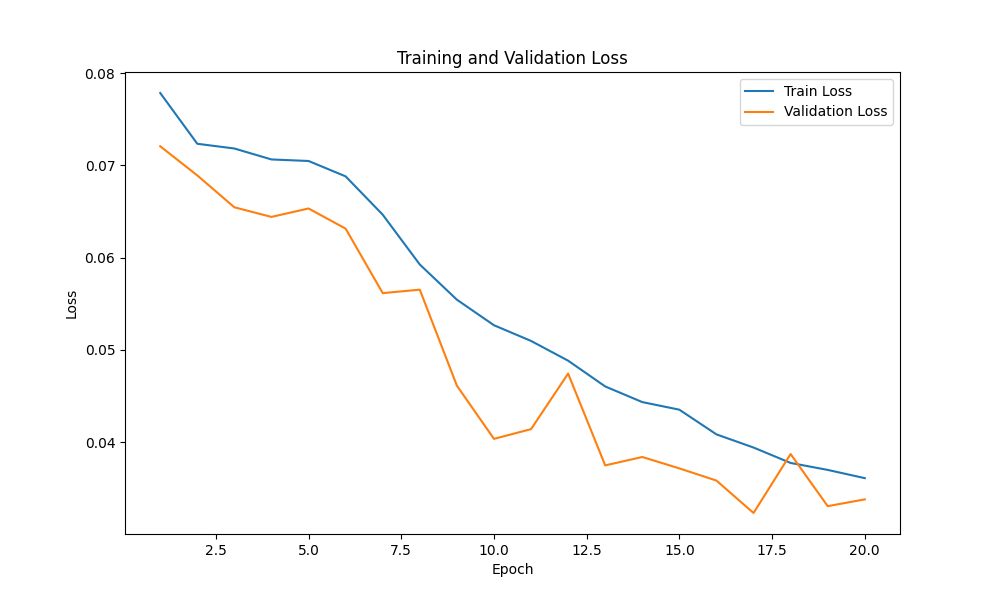
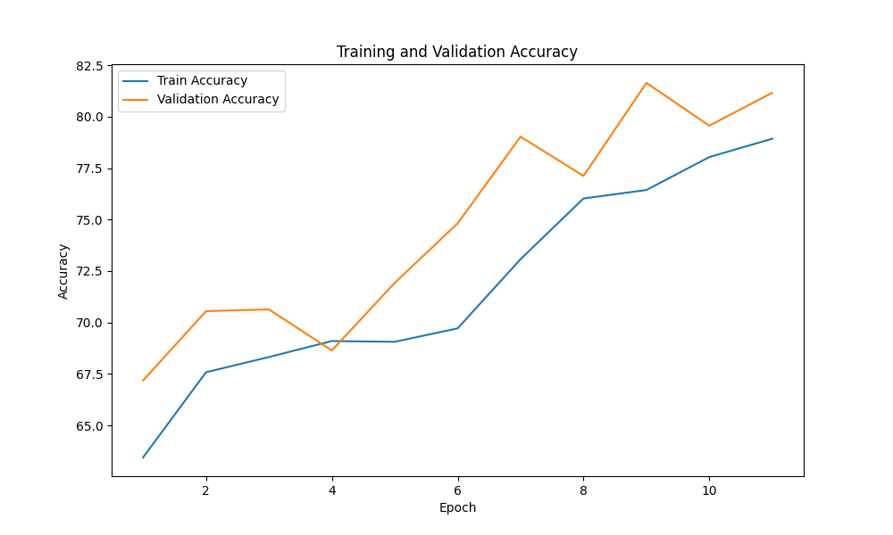
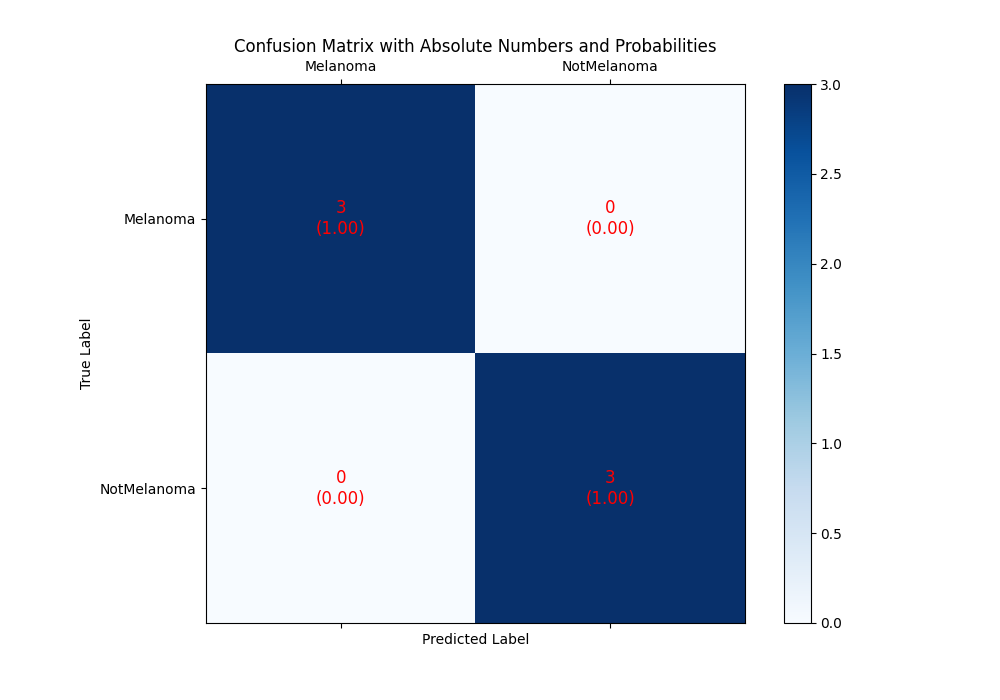
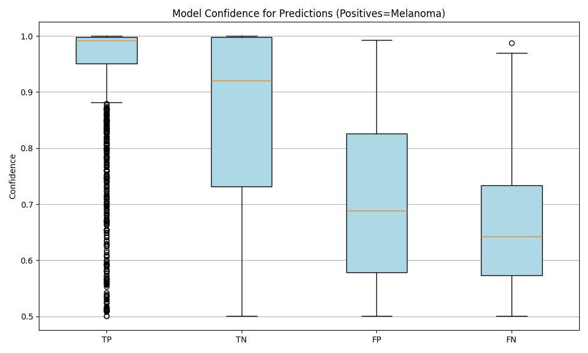
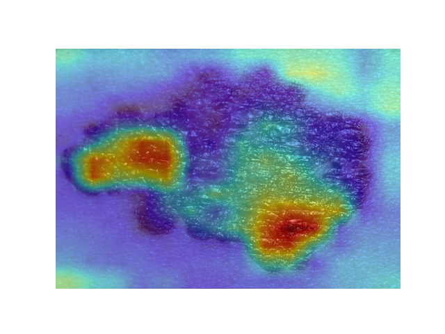
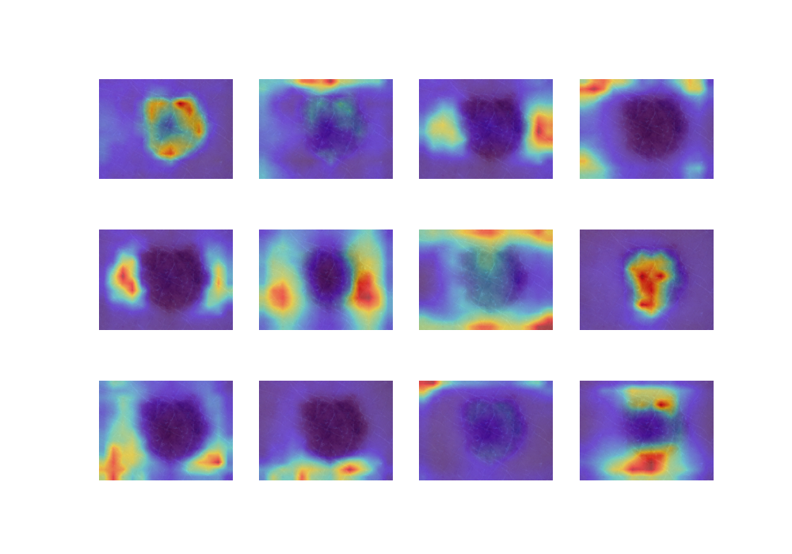

# melanoma-classification

> Please note that the code and contributions in this GitHub repository were created through a collaborative effort by [@Irish-77](https://github.com/Irish-77) and [@Ronho](https://github.com/Ronho). Both contributors acknowledge that their work is of equal merit and that they each have a deep understanding of the other's contributions.

This project involves implementing a Vision Transformer (ViT) from scratch to classify skin lesions into melanoma and non-melanoma categories. The goal is to achieve high accuracy, comparable to state-of-the-art models, while working with a small dataset. Notebooks we found on Kaggle demonstrated approximately >90% accuracy using traditional ResNet models, and we aim to replicate or approach this level of performance with the ViT.

## Table of Contents

1. [Installation](#installation)
2. [Usage](#usage)
3. [Description](#description)
4. [Outlook](#outlook)

## Installation

### Local Build

First, clone this project by running the command:

```sh
git clone https://github.com/C2G-BR/melanoma-classification.git
```

### Download model

*TBD*

## Usage

- How to predict?
- How to get attention maps?

## Description

### Datasets

Our approach is to train the model on multiple skin lesion datasets, where we replace only the classifier head for each dataset while continuing to fine-tune the shared backbone. Some datasets include additional labels beyond benign and malignant, such as "possibly malignant," allowing for more nuanced classification tasks. In the future, we envision giving the user the flexibility to choose the specific classes they want to predict and select the corresponding classifier accordingly. The first-generation model, however, is only trained on the DermMel dataset, which contains 17,000 images (balanced 50%) that are already split into training, validation, and test sets.

| Name                                                                           | Description | Num classes |
| ------------------------------------------------------------------------------ | ----------- | ----------- |
| [DermMel](https://www.kaggle.com/datasets/drscarlat/melanoma)                  |             | 2           |
| [HAM10000](https://www.kaggle.com/datasets/kmader/skin-cancer-mnist-ham10000)  |             | 2           |
| [PH2](https://github.com/vikaschouhan/PH2-dataset/blob/master/PH2_dataset.txt) |             | 3           |

### Model

- VIT (implemented from scratch using PyTorch)
- pretrained on deit_base_patch16_224 (includes same configuration, i.e. patch size, embedding dimension etc.)

#### Training

During the initial iterations of training, we encountered several challenges. Initially, we trained the entire model from scratch, but as expected, the model struggled to learn effectively. Even with a very small learning rate, the model failed to make meaningful progress. We also observed that when batches were less balanced in terms of class distribution, the model's weights would update too drastically, leading to predictions heavily biased toward the dominating class until a batch with the opposite class distribution was processed.

In response, we decided to freeze the backbone and train only the classifier, which we also improved by deepening the network from a single layer. This approach allowed us to reach an accuracy of around 70%. After training the classifier for a few epochs, we proceeded to unfreeze the entire backbone. However, this caused the accuracy to drop back to around 50%, even though we had reduced the learning rate significantly.

To address this, we adopted a more gradual approach, unfreezing one layer at a time every few iterations, starting from the transformer encoders and progressing up to the positional embeddings. By using this technique, we were able to achieve nearly 90% accuracy.

To replicate this training process, you can follow our [training notebook](modelling/training.ipynb). Below, we also visualize some key training results:


In the plot above, we can see a solid decrease in both training and validation loss, with some temporary spikes in the validation loss, which occurred when we unfroze additional layers.


In the plot above, we observe a consistent increase in accuracy over time, with the validation accuracy even slightly outperforming the training accuracy, indicating that the model is robust and not significantly overfitting.

#### Evaluation

In the previous section, we analyzed key training metrics, such as loss and accuracy over epochs, to assess the overall learning process of the model.
In this section, we will delve deeper into the model's performance and analysis.

We begin with the model's performance evaluation, which is highlighted through the confusion matrix. 



The confusion matrix demonstrates strong performance in melanoma detection, showing a good balance between high sensitivity (correctly identifying melanoma cases) and reasonable specificity (correctly identifying non-melanoma cases).
The main trade-off lies in a slightly higher false positive rate, where non-melanoma cases are misclassified as melanoma.
However, this may be acceptable given the critical importance of minimizing missed melanoma diagnoses.



The figure above provides insight into the model’s confidence for different types of predictions. The model exhibits high confidence when correctly identifying melanoma (true positives), suggesting strong reliability in these cases. However, false positives—where non-melanoma is incorrectly classified as melanoma—are accompanied by relatively high confidence, indicating the need for improvement to reduce overconfidence in incorrect predictions. False negatives, on the other hand, show the lowest confidence, which is a positive finding. This indicates that the model is less confident when misclassifying melanoma as non-melanoma, which aligns with the goal of prioritizing melanoma detection.

Additionally, attention visualization helps in understanding how the model focuses on different regions of the images. The attention map for a single image, as well as the averaged attention over all heads in the last transformer encoder layer, provide insights into the areas of the image the model considers most relevant for its predictions:





In melanoma classification, key features like irregular borders, color changes, and asymmetry are often used to distinguish melanomas from non-melanoma lesions (refer to [PubMed Central](https://pmc.ncbi.nlm.nih.gov/articles/PMC9562203/)).
The attention maps seem to reflect this by focusing on different areas that might correspond to such features.

For more detailed exploration and to replicate the results, the respective evaluation notebook can be found [here](modelling/evaluation.ipynb).

## Outlook

In the future, if time permits, we aim to push the model's accuracy to at least 95% by refining the training process. One strategy is to increase the dropout rate in further training sessions to enhance generalization. Additionally, we plan to extend the model's applicability by training it on one of the other datasets we previously mentioned, which could help improve performance and robustness across different skin lesion classification tasks.